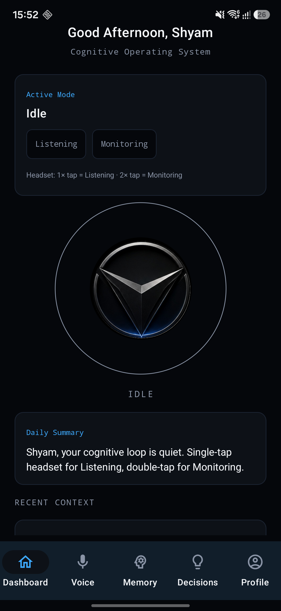

<div align="center">

# CoinV

### Your cognitive operating system

Voice-first thinking, semantic memory, better decisions, and an AI coach that
learns how you work.

[](https://github.com/ShyamRV/coinv-intelligence/actions/workflows/build.yml)


</div>

<p align="center">
  
</p>

## Think out loud. CoinV handles the rest.

CoinV turns everyday conversations into useful context. It remembers what
matters, helps structure difficult decisions, tracks commitments, and surfaces
the right challenge at the right moment—without forcing your thoughts into a
traditional productivity system.

### Three modes, one cognitive loop

- **Idle** — private, quiet, and ready.
- **Listening** — ask CoinV a question and hear a concise spoken response.
- **Monitoring** — collect context silently and respond only to explicit
  requests.

Headset controls keep the interaction frictionless: single tap for Listening,
double tap for Monitoring, and tap again to stop.

## What CoinV can do

| | Capability | What it means |
|---|---|---|
| 🎙️ | Voice intelligence | Speech recognition, live transcripts, spoken replies, audio focus, and foreground listening |
| 🧠 | Semantic memory | Values, facts, ideas, and conversations recalled by meaning—not just keywords |
| ⚖️ | Decision engine | Structured pros, cons, risks, opportunities, missing information, and outcome follow-ups |
| 🎯 | Goals and tasks | Task-backed progress with a cognitive timeline of meaningful activity |
| 🔍 | Smart interventions | Devil's advocate, bias spotting, promise tracking, and commitment overload warnings |
| 📈 | Personalization | Learns from feedback, context, active hours, and accepted suggestions |
| 🔐 | Local-first privacy | Offline embeddings and guidance by default, with explicit control over cloud AI |

## Screens

`Dashboard` · `Voice` · `Memory Vault` · `Decisions & Goals` · `Profile` ·
`About Me` · `Timeline`

CoinV supports dark, light, and system themes, reduced-motion accessibility,
configurable memory retention, JSON export, and complete local reset.

## Quick start

### Requirements

- Flutter stable with Dart 3.13+
- Android SDK with API 26 or newer
- Java 17

### Run locally

```powershell
flutter pub get
flutter run
```

CoinV starts in **local-only mode**, so the core app works without API keys.
For cloud coaching and Gemini embeddings:

```powershell
flutter run `
  --dart-define=ASI_ONE_API_KEY=your_asi_key `
  --dart-define=GEMINI_API_KEY=your_gemini_key
```

Then disable **Local-only processing** from Profile. Never commit API keys.

## Architecture

```text
Flutter UI
   │
   ├── CoinVController ── voice modes, lifecycle, orchestration
   │
   ├── Intelligence services ── context, coaching, metrics, personalization
   │
   ├── SQLite data layer ── memory, decisions, goals, interventions, timeline
   │
   └── Android bridge ── audio focus, haptics, MediaSession, foreground service
```

The product and business logic is Dart. Minimal Kotlin under
`android/app/src/main/kotlin/` exposes only Android platform behavior that
Flutter cannot provide directly.

The original Kotlin/Compose implementation is retained under
`native-android/` as a reference build and uses the separate
`com.coinv.app.legacy` application ID.

## Data migration

When upgrading from the native app, CoinV detects `coinv_v103.db` and performs
an idempotent, transactional import. Conversations, memories, values,
decisions, goals, context, interventions, and promises are preserved. The
source database is never deleted.

## Quality checks

```powershell
dart format --output=none --set-exit-if-changed lib test integration_test
flutter analyze
flutter test
flutter test integration_test -d <android-device>
flutter build apk --debug
flutter build apk --release
```

CI runs formatting, analysis, tests, the Flutter Android build, and the retained
native Android build on every pull request.

## Release signing

Release signing is loaded from the ignored `android/key.properties` file:

```properties
storeFile=C:\\secure\\coinv-upload.jks
storePassword=...
keyAlias=...
keyPassword=...
```

Without that file, Gradle produces an unsigned release artifact for local
verification.

## Repository layout

```text
.
├── lib/                 # Flutter product code
├── test/                # Unit and widget tests
├── integration_test/    # Android device smoke tests
├── android/             # Flutter Android host
├── native-android/      # Retained Kotlin/Compose reference
└── .github/workflows/   # CI
```

<div align="center">

**CoinV — reflect less on what you forgot, and more on what matters next.**

</div>
